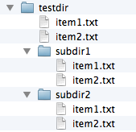

# glob-rename

A Python command line tool for global renaming of files in a single directory or directory tree.

 
 

## Example

An example of replacing all instances of a string 'file' by another string 'item' in all .txt files in a directory tree:

	./glob-rename.py testdir/ -s item -r file -w
	Checked 8 items and renamed 6 files(s) of item

### before:

### after:

 
 

## Usage

An overview of all command line arguments.

<pre>./glob-rename.py -h
usage: glob-rename.py [-h] [-s SEARCH] [-r REPLACE] [-w] [-e EXTENSIONS] [-v]
                      start_dir

A command line tool for global renaming of files.

positional arguments:
  start_dir

optional arguments:
  -h, --help            show this help message and exit
  -s SEARCH, --search SEARCH
                        String to be replaced.
  -r REPLACE, --replace REPLACE
                        String to replace the search query with.
  -w, --walk            Applies the global replacement recursively to sub-directorires.
  -e EXTENSIONS, --extensions EXTENSIONS
                        Only process files with particular extensions. Comma separated, e.g., ".txt,.py"
  -v, --version         show program's version number and exit</pre>